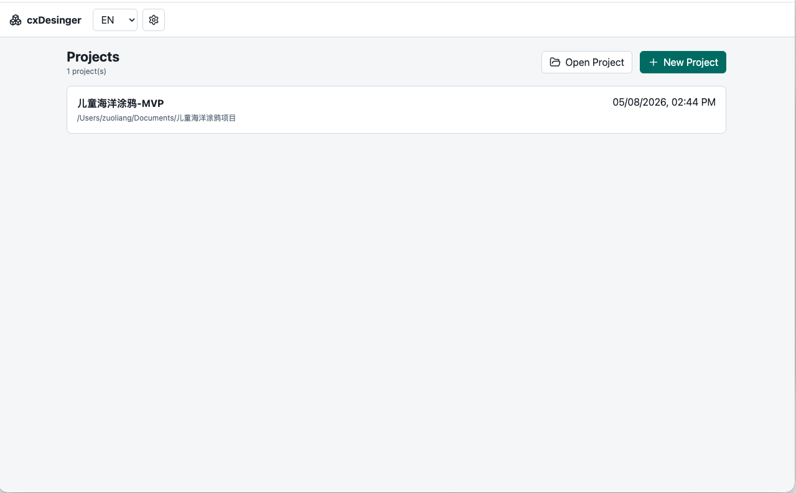
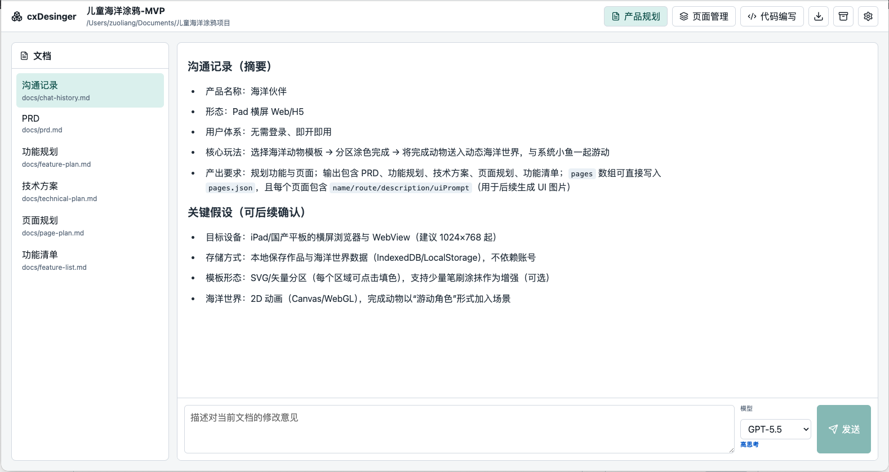
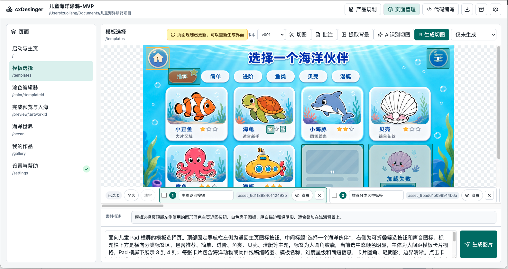
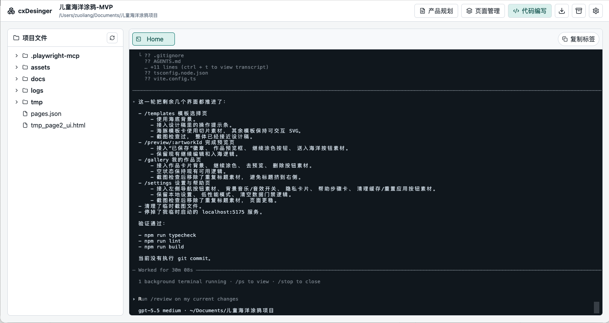

# cxDesinger

[English](./README.md)

cxDesinger 是一个围绕 Codex 构建的开源 AI 产品设计工作台。你可以把它理解成面向 AI 原生产品创造流程的“开源 Figma 雏形”：产品规划、界面生成、视觉资产提取和代码实现不再分散在多个工具里，而是汇聚到同一个本地桌面工作区。

它希望把一个产品想法逐步变成可落地的项目资产：需求沉淀为持续演进的文档，页面规划生成 UI 概念图，UI 概念图拆解为可复用素材，同一个工作区还能继续进入代码编写。我们的目标不是再做一个普通的 Chat UI，而是探索一个开放、可二次开发、面向 AI 时代的产品设计到代码实现操作系统。

> 当前项目仍处于早期验证阶段，但方向会比较激进：做一个开源、可黑客化、从产品设计直达代码实现的 AI 工作台。Codex CLI 与图片生成能力不随应用内置，需要用户自行安装和认证。

## 为什么做 cxDesinger

- **AI 产品创造的 Figma 式中枢**：把产品思考、页面设计、素材切图和实现上下文放到同一个工作台里。
- **本地优先，资产自有**：生成的文档、界面图、背景图、切图素材和元数据都保存在用户自己的项目目录中。
- **AI 原生设计流水线**：Codex 不只是聊天，而是读取项目上下文、更新规划文档、生成界面、提取素材，并产出后续实现可索引的结构化信息。
- **面向真实构建者**：流程不会停在演示稿，最终会进入项目文件树和 Codex 终端，让设计决策可以继续变成代码。

## 功能概览

### 项目工作区



- 新建自包含产品项目，或打开已有项目文件夹。
- 初始化 `docs/`、`assets/`、`logs/`、`pages.json`，并为产品项目初始化本地 Git 仓库。
- 将规划文档、UI 图片、生成素材、切图区域和页面元信息保存在用户选择的项目目录内。
- 将当前 AI 产品项目导出为 ZIP，方便归档或交付。
- 支持在 English、简体中文、Deutsch 之间切换应用界面语言。

### 产品规划



- 用自然语言描述产品想法，由 Codex 生成结构化规划资料。
- 生成并维护 PRD、功能规划、技术方案、视觉规范、页面规划、功能清单；APP 项目可额外生成动效清单。
- 在应用内以 Markdown 方式阅读生成文档。
- 支持对文档行级添加备注，并针对单个文档发送修改意见，避免每次都重新生成整套规划文档。
- 支持将 `page-plan.md` 同步回 `pages.json`，让后续 UI 生成使用最新页面列表和页面描述。

### 页面设计与资产提取



- 根据 `pages.json` 和用户提示词，为每个页面生成 UI 概念图。
- 页面图片按版本保存在本地，可以切换当前激活版本，不覆盖历史结果。
- 支持在已有 UI 图片上圈选批注，将批注内容和参考图一起交给 Codex，重新生成新的页面版本。
- 支持提取干净可复用的页面背景，并将背景路径写入 `pages.json`。
- 支持 AI 自动识别可切图区域，用户确认、编辑、选择多个区域后批量生成素材。
- 支持对已生成素材的选区进行强制重切，便于重试漏切、多切或效果不佳的素材。
- 生成素材会写入稳定的 ID、名称、描述、路径、源图和选区坐标，方便后续让 AI 或开发者按素材索引实现页面。

### 代码编写



- 通过内置文件树浏览当前产品项目目录。
- 文本文件可在编辑标签中打开，支持行号、语法高亮、格式化和保存冲突保护。
- 固定 Home 标签运行一个位于当前项目目录下的 Codex 终端。
- 支持复制终端或文件标签，方便并行处理不同实现任务。

### 安全边界

- 渲染进程不直接访问文件系统或启动进程。
- 文件系统、Codex、终端、ZIP、图片相关能力都通过 Electron 主进程和 preload IPC API 提供。
- 项目文件默认保留在本地，除非用户主动导出或发布。

## 重要：Codex 认证方式

cxDesinger 期望 Codex 使用账号认证方式运行，通常是通过 Codex CLI 的浏览器登录流程完成认证。

不要依赖仅 API Token 的方式运行本应用：

- 页面生图和素材生成依赖 Codex 内置的图片生成能力。
- 仅 API Token 的方式不是本应用图片生成工作流支持的路径。
- 产品规划、UI 生成和批量素材生成会消耗较多使用额度。

强烈建议使用额度充足的付费套餐。如果要长期高频使用，建议选择支持较长 Codex 会话和图片生成额度的付费档位。如果你考虑的是每月约 20 美元的入门付费档位，建议先确认当前 Codex 和图片生成额度；具体套餐名称、价格和额度始终以 OpenAI 官方页面为准。

## 系统要求

- macOS，当前打包脚本主要面向 Apple Silicon。
- Node.js 20 或更高版本。
- npm 10 或更高版本。
- 已安装 Codex CLI，并通过账号登录流程完成认证。

如果应用无法从 `PATH` 找到 Codex CLI，可以在设置中填写完整路径，或通过环境变量指定：

```bash
CODEX_CLI_PATH=/absolute/path/to/codex
```

## 快速开始

```bash
npm install
npm run dev
```

开发模式默认启动 Vite 和 Electron。渲染进程地址通常为 `http://127.0.0.1:5173/`。

如果需要使用固定端口调试：

```bash
npm run dev:renderer -- --host 127.0.0.1 --port 5184
VITE_DEV_SERVER_URL=http://127.0.0.1:5184 npm run dev:electron
```

## 常用命令

```bash
npm run typecheck
npm test
npm run build
npm run dist:mac:arm64
```

- `typecheck`：检查渲染进程和主进程 TypeScript。
- `test`：运行 Vitest 单元测试。
- `build`：构建 Electron 主进程和 Vite 渲染产物。
- `dist:mac:arm64`：生成 Apple Silicon 未签名 DMG，输出到 `release/`。

## 项目数据结构

用户创建的 AI 产品项目目录是自包含的：

```text
project-root/
  docs/
  assets/
  logs/
  pages.json
```

核心数据在 `pages.json` 中维护：

- `project`：项目基础信息和项目类型。
- `documents`：生成或修改后的文档索引。
- `pages`：页面规划、UI 提示词、当前图片版本、背景图和更新状态。
- `sliceSelections`：用户或 AI 识别出的切图区域。
- `assets`：已生成素材，包含稳定 `id`、名称、描述、路径和来源选区。

## 架构概览

```text
electron/
  main/       Electron 主进程，负责文件系统、Codex 调用、终端、ZIP 导出
  preload/    安全 IPC API 暴露
src/
  renderer/   React 渲染进程
  shared/     主进程与渲染进程共享类型和校验
tests/        服务、Provider、组件与工具函数测试
```

渲染进程不直接访问文件系统或启动进程，所有能力都通过 preload 暴露的最小 IPC API 调用。

## 安全与隐私

- 应用会读取用户选择的项目目录，并在该目录内创建或修改项目文件。
- Codex 调用可能读取项目内文档、页面规划、图片路径和资源描述。
- 本项目不内置 API Key，也不要求在仓库中保存任何密钥。
- 不要提交 `.env`、日志、生成包、用户项目数据或包含敏感内容的截图。

## 打包说明

```bash
npm run build
npm run dist:mac:arm64
```

当前 DMG 未签名、未 notarize。分发给测试用户时，macOS 可能需要通过右键打开，或在系统设置里允许打开。

## 贡献

欢迎提交 Issue 和 Pull Request。开始前请阅读 [CONTRIBUTING.md](./CONTRIBUTING.md)。

## 许可证

本项目基于 [MIT License](./LICENSE) 开源。
